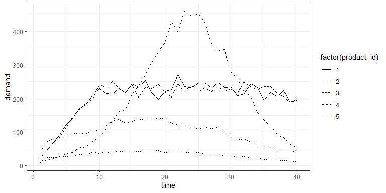
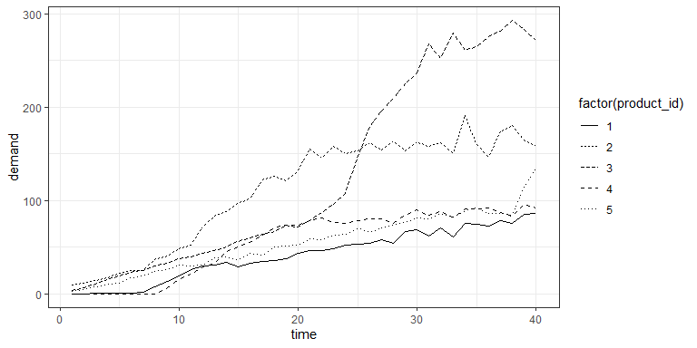

<!-- README.md is generated from README.Rmd. Please edit that file -->

# npdsim

<!-- badges: start -->

[](https://github.com/mohammedhichame/npdsim/actions/workflows/R-CMD-check.yaml)
<!-- badges: end -->

The goal of npdsim is to simulate the demand for ready to launch new
products over their life cycle, and to simulate their attributes. The
generated data will help you test and compare your new product demand
forecasting approaches.

The simulation of demand is based on the idea that each product has a
demand level and a demand shape where level is the cumulative demand of
the product over a specific number of time periods (the number of time
periods is set by the user), and shape is the normalized demand over
those periods. The attributes of each product are assumed to be linked
to its shape and level.

## Installation

You can install the development version of npdsim from
[GitHub](https://github.com/) with:

``` r
# install.packages("pak")
pak::pak("mohammedhichame/npdsim")
```

## Example

This is a basic example which shows you how to simulate the demand and
attributes for 200 products:

``` r
library(npdsim)

npd_data1 <- npd_data_sim(products_number=200,
                         periods_number=40,
                         shape_number=7,
                         level_number=30)

str(npd_data1)
#> 'data.frame':    8000 obs. of  13 variables:
#>  $ product_id : int  1 1 1 1 1 1 1 1 1 1 ...
#>  $ time       : num  1 2 3 4 5 6 7 8 9 10 ...
#>  $ demand     : num  17 33 45 59 77 97 115 136 189 190 ...
#>  $ attribute6 : num  0.767 0.767 0.767 0.767 0.767 ...
#>  $ attribute7 : num  0.22 0.22 0.22 0.22 0.22 ...
#>  $ attribute4 : num  0.569 0.569 0.569 0.569 0.569 ...
#>  $ attribute2 : num  0.366 0.366 0.366 0.366 0.366 ...
#>  $ attribute8 : num  0.519 0.519 0.519 0.519 0.519 ...
#>  $ attribute3 : num  0.487 0.487 0.487 0.487 0.487 ...
#>  $ attribute1 : num  0.179 0.179 0.179 0.179 0.179 ...
#>  $ attribute5 : num  0.243 0.243 0.243 0.243 0.243 ...
#>  $ attribute9 : num  0.943 0.943 0.943 0.943 0.943 ...
#>  $ attribute10: num  0.625 0.625 0.625 0.625 0.625 ...
```

The demand for the products with product_id=1,2,…,5 is shown below:



You can also generate the demand over only the introduction and growth
phases of products. For example :

``` r

npd_data2 <- npd_data_sim(products_number=200,
                         periods_number=40,
                         shape_number=7,
                         level_number=30,
                         shape_type="intro & growth")
```



We can also only simulate the demand or attributes of products using the
functions `demand_sim` or `attribute_sim_dep` (or also
`attribute_sim_ind`).
